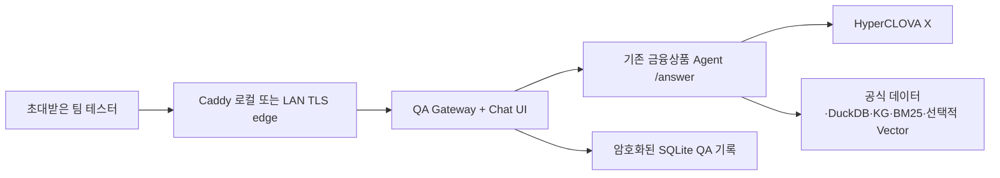

# HCX 전용 인간 검증 챗봇

기준 브랜치: `codex/human-qa-chatbot-v1`

분류: 대회 제출 API와 분리된 팀 내부 품질검증 도구

공개 배포: 금지

현재 live 상태: `PENDING_EXTERNAL`

## 1. 목적과 변경하지 않은 경계

이 기능은 대회 제출용 제품을 다른 제품으로 바꾸는 작업이 아니다. 기존 금융상품
Agent의 `GET /answer`와 `question_id`, `question`, `retrieved_context`,
`think_trace`, `answer` 다섯 문자열 응답 계약은 그대로 유지한다. QA 챗봇은 사람이
여러 턴에 걸쳐 질문하고, 답변과 공식 근거·조건·검색 경로를 함께 판정하여 피드백을
남기는 별도 서비스다.

QA Gateway는 LLM provider가 아니며 답변을 생성하지 않는다. 인증·동의, 세션 버전,
멱등성, 대화 참조의 결정적 재구성, clarification token의 1회 사용, 저장·삭제,
피드백과 검사 화면만 담당한다. 실제 인간 파일럿 runtime의 유일한 LLM은 기존 엔진의
HyperCLOVA X다. Codex·OpenClaw·다른 모델·자동 모델 폴백은 포함하지 않는다.

## 2. 제품 화면

데스크톱은 다음 세 영역으로 구성한다.

1. 왼쪽: 새 자유 테스트, 이전 세션, 필수 가이드 12개
2. 가운데: 시간순 사용자·Agent 메시지, 추가 질문, 재시도, 피드백
3. 오른쪽: `ConditionLedger`, 공식 필드 근거, RetrievalTrace 검사

좁은 화면에서 세션 목록은 왼쪽 modal drawer, 검사 패널은 bottom sheet로 전환한다.
둘 다 focus trap, `Escape`, 배경 `inert`, 닫은 뒤 trigger focus 복원을 사용한다. 상단은
화면 폭과 무관하게 `팀 내부 인간 검증 환경`, 비투자자문 고지, fixture/live 상태,
데이터 기준일·해시, 엔진 SHA, HCX model lock, planner와 Vector 상태를 표시한다.

브라우저 공개 상태는 다음 다섯 가지뿐이다.

- `FULL`: 요청 조건과 근거가 모두 충족된 답변
- `NEEDS_CLARIFICATION`: 결과를 바꾸는 조건 하나를 확인 중
- `SAFE_LIMITED`: 일부 근거·비교 한계 또는 안전 제한을 명시한 답변
- `UNAVAILABLE`: 공식 데이터나 계약으로 답할 수 없음
- `RETRYABLE_ERROR`: timeout·429·503·계약 오류처럼 재시도 가능한 실패

검사 패널은 상품별 공식 파일·sheet·Excel row·field·값·단위·기준일·품질·row hash를
묶어 보여 주고, Exact/SQL/Graph/BM25/Vector의 후보 수와 SQL 재검증 수, 폴백 사유,
근거 참조를 표시한다. 내부 prompt, chain-of-thought, raw clarification token, 보존
실행계획은 브라우저에 내보내지 않는다.

## 3. 대화 상태 규칙

- 엔진의 clarification token은 AES-256-GCM으로 서버에만 보관하고, 해당 assistant
  message에 대한 답변으로 정확히 한 번만 사용한다.
- 사용 완료·만료·이전 clarification button은 비활성화하며 stale, 변조, 다른 세션 사용은
  `409` 또는 통제된 `UNAVAILABLE`로 끝낸다.
- “그중 두 번째”, “그 상품”은 마지막 완료 결과의 상품 UID·코드·정확명에만 연결한다.
- 후보가 하나가 아니면 로컬 clarification 하나를 제시하며 HCX를 호출하지 않는다.
- “수익률 말고 보수” 같은 명시적 정정은 기존 조건을 대체하고 변경 전후를 검사 패널에
  표시한다.
- 일반 후속 질문은 활성화된 구조화 조건과 새 요청을 독립 실행 가능한 한 문장으로
  재구성한다. 이전 Agent 답변 문장이나 전체 대화 transcript는 HCX에 넣지 않는다.
- 새 질문·새 세션은 참조 대상과 활성 조건을 제거한다.
- 교차 상품군은 조건 부족 때문에 거부하지 않고, 필요한 조건을 하나씩 확인해 실행한다.
- 중요한 조건이 `clarification_required`, `unavailable`, `not_comparable`인데 엔진이
  `FULL`을 주장하면 Gateway가 그대로 승격하지 않고 fail-closed한다.

## 4. QA API

모든 endpoint는 동일 출처의 `/qa/api/v1` 아래에 있다. 대회용 `/answer`는 QA edge에서
노출하지 않는다.

| Method | Path | 역할 |
|---|---|---|
| POST | `/invites/redeem` | 1회용 invite와 동의 제출 |
| POST | `/logout` | auth session 폐기 |
| GET | `/me` | 익명 tester와 retention 확인 |
| POST | `/sessions` | 자유 또는 guide session 생성 |
| GET | `/sessions` | 본인 session 목록 |
| GET | `/sessions/{id}` | version과 message page 조회 |
| POST | `/sessions/{id}/messages` | 멱등 turn 제출 |
| PUT | `/messages/{assistant_id}/feedback` | 판정·문제 tag·메모 저장 |
| GET | `/sessions/{id}/export?format=json\|markdown` | 정제된 기록 내보내기 |
| DELETE | `/sessions/{id}` | 연결된 session data 즉시 삭제 |
| GET | `/status` | kill switch, release gate, engine 상태와 manifest |

메시지는 `client_message_id`, `expected_session_version`, `text`와 선택적
`reply_to_message_id`, `clarification_option_value`를 받는다. 같은 ID·같은 본문은 기존
결과를 반환하고 엔진을 다시 부르지 않는다. 같은 ID·다른 본문, 두 tab의 version 충돌,
진행 중 동일 tester의 두 번째 호출은 `409`다.

피드백은 `accurate`, `partly_accurate`, `incorrect`, `uncertain`이며 문제가 있는 판정은
최소 한 개의 오류 tag를 요구한다. 허용 tag는 `WRONG_PRODUCT`, `WRONG_VALUE`,
`MISSING_CONDITION`, `BAD_CLARIFICATION`, `WRONG_COMPARISON`,
`EVIDENCE_MISMATCH`, `UNSAFE_LANGUAGE`, `SLOW`, `OTHER`다.

## 5. 저장·개인정보·로그

- SQLite WAL, 단일 Uvicorn worker, transaction 기반 session version을 사용한다.
- 질문·답변·정제 근거·conversation state·engine exchange·feedback note는
  AES-256-GCM으로 암호화한다.
- invite와 auth/CSRF token은 domain-separated HMAC hash만 저장한다.
- transcript key, auth/cookie key, engine clarification signing key, HCX API key는 서로
  다른 32-byte 이상 secret file로 만들고 Docker secret으로 주입한다.
- 주민번호·카드·전화·email·계좌 형태는 HCX 전송 전 차단한다. 공식 상품 code 형태는
  허용한다. feedback note에도 같은 차단을 적용한다.
- access log를 끄고 application log에는 request ID, 익명 tester hash, 문자 수, 공개
  상태, provider 시도 여부, 지연만 남긴다. 질문·답변·근거·cookie·IP·User-Agent·key는
  기록하지 않는다.
- session data는 생성 후 14일에 자동 삭제한다. 시작 시·매일 purge하며 사용자의 즉시
  삭제도 지원한다. 누적 pilot call counter는 일별 ledger purge와 별도로 보존한다.
- JSON/Markdown export에는 raw engine response, clarification token, private trace,
  prompt, credential을 포함하지 않는다.

## 6. 호출 제한과 실패 처리

- tester 동시 1, 분당 5, 하루 30
- 전체 HCX 시작 분당 8, 하루 200, pilot 누적 1,000
- Gateway 동시 engine slot 3, queue 포함 총 deadline 25초
- 2분 안에 연속 실패 5회면 60초 circuit open
- `PILOT_CHAT_ENABLED=false`는 새 turn만 잠그고 조회·export·delete·logout은 유지
- timeout, 429, 503, invalid JSON, 다섯 문자열 계약 변경은 공개 5xx 대신 통제된
  `RETRYABLE_ERROR` 또는 `UNAVAILABLE`로 저장한다.
- 다른 모델로 폴백하지 않는다.

## 7. 배포 경계와 release gate

`compose.qa.yaml`은 `engine`, `qa-gateway`, local 또는 LAN Caddy edge를 구성한다.
engine과 gateway는 호스트 port가 없고 internal backplane에만 연결된다.

- 로컬 profile: `127.0.0.1:8090` HTTP만 bind
- LAN profile: host에 실제 할당된 RFC1918 주소의 `:8443`만 bind, Caddy internal CA TLS
- router port forwarding과 public DNS 금지
- QA·engine root filesystem read-only, capability drop, no-new-privileges
- 쓰기 가능한 application data는 `qa_state` volume뿐
- Windows firewall rule은 선택한 bind IP와 전체가 RFC1918 안에 포함되는 subnet만 허용

QA service는 사람이 승인한 `HCX_MODEL_ID`와 `APPROVED_HCX_MODEL_ID`, endpoint lock,
engine Git SHA, immutable image identity, serving data hash, two-stage planner, 실제 20문항
smoke와 100문항 canary의 정제된 증거가 모두 일치할 때만 새 turn 준비 상태가 된다.
20과 100은 대회 공식 평가 문항 수가 아니라 내부 단계 gate다. environment string 하나로
PASS를 선언할 수 없으며, strict schema와 canonical self-hash를 가진 read-only artifact를
검증한다.

실행·비밀 생성·invite 발급·방화벽·CA·backup·shutdown 명령은
`deploy/qa/README.md`를 따른다. `down -v`는 retained QA session을 영구 삭제하므로 별도
승인 없이 사용하지 않는다.

## 8. 검증 체계

자동 검증은 다음을 포함한다.

- 기존 전체 pytest, Ruff, runtime compliance, 기존 640문항 oracle
- 기존 `GET /answer` path/status/다섯 문자열 schema 회귀
- invite/auth/consent/CSRF/origin, encrypted-at-rest, log/export redaction
- create/resume/delete/export, restart persistence, two-tab conflict, duplicate-click idempotency
- 2·3·4턴 조건 보충, correction, ordinal/pronoun, metric/scope change, cross-scope
- clarification expiry/tamper/reuse/cross-session rejection
- engine timeout/429/503/invalid JSON/schema drift와 circuit breaker
- 동시 10 tester·총 100 turn, 정확한 429, QA 5xx 0
- React unit/interaction tests, axe structural tests, 실제 브라우저 axe와 console 확인
- 320px, tablet, desktop, 200% zoom, keyboard, 44px target, reduced motion, forced colors
- Docker no-cache build, read-only start/restart/health/status, blocked contest routes

NVDA, Windows high contrast의 실제 조작, LAN의 다른 승인 기기 접속, 5~10명 pilot은
사람 검수다. pilot은 각 tester가 guide 12개와 자유 질문 5개 이상을 실행하고 과제 성공률
90%, clarification 완료율 95%, 조건 이해율 90%, 60초 안 근거 탐색 85% 이상을 목표로
한다. 잘못된 `FULL`, 조건 무언 누락, 교차질의 거부, 허위 근거는 각각 0건이어야 한다.

### 2026-08-09 현재 코드 재실행 증거

- 공식 원본 PDF·ZIP·팀 원문 및 ZIP 내부 XLSX 8개 해시 검증: PASS
- 전체 Python: pytest **365/365**, Ruff PASS
- runtime compliance: **179 files / 0 findings**; HyperCLOVA X 외 LLM 경로 없음
- 기존 oracle **640/640**, 교차질의 거부 0; metamorphic **137/137**
- Federated holdout **100/100**, Graph **120/120**, BM25 **20/20**, v4 **200/200**
- deterministic offline assurance: **5,000/5,000**; 10군×500, live provider call 0
- live corpus의 local preflight: 독립 단일질의 **1,200/1,200**, 다중 흐름
  **300/300**(2·3·4턴 각 100, 총 900 API 상태 전이), live provider call 0
- React·TypeScript: **11 test files / 22 tests**, production build PASS
- 실제 브라우저: 320px와 1280→640 CSS px reflow, dialog focus/Escape/inert,
  axe violation 0, console/runtime error 0. native 200% zoom·NVDA·Windows 고대비는 사람 검수
- QA 배포 보강: release/QA **75 tests**, Caddy 2종·local/LAN Compose·Dockerfile
  정적 검사 PASS. 최종 clean HEAD에서 engine·QA image를 no-cache로 다시 빌드하고
  restart·healthcheck를 통과했다. 로컬 fixture preview는 Gateway `127.0.0.1:8090`만
  게시하고 engine host port를 닫았으며, 보존 키는 상속을 끊은 사용자 전용 ACL 경로에 둔다.

첫 전체 회귀에서는 새 `verified_count`가 strict evidence JSON Schema에 빠진 계약 오류
1건을 실제로 발견했다. schema에 optional non-negative integer/null로 추가하고 해당 계약
9/9 및 최종 전체 365개를 처음부터 재실행해 통과했다.

## 9.1 남아 있는 기술적 경계

- HCX 제공자가 provider-level idempotency key를 보장하지 않으므로 응답 수신 직후
  process가 죽고 DB commit 전 lease까지 만료되는 극단적 경우 외부 호출 재시도 가능성이
  남는다. Gateway 수준의 동시 중복·재전송·lease 복구는 검증했다.
- PII 방어는 주민·외국인번호, 전화, 카드, 구분자 계좌 패턴을 차단하고 checksum-valid
  ISIN만 상품코드 예외로 허용한다. 모든 자연어 우회 표현을 완전 판별한다는 주장은 하지
  않는다.
- pilot 규모 저장량 상한은 SQL 합산으로 fail-closed한다. 대규모 장기 서비스로 확장할
  경우 누적 quota counter를 별도 설계해야 한다.
- 실제 Windows 방화벽 설치, LAN 다른 기기의 Caddy CA 신뢰, native browser 200% zoom,
  NVDA·Windows 고대비는 승인된 사람과 기기에서만 수행한다.

## 10. 정직한 현재 상태

| 항목 | 상태 | 설명 |
|---|---|---|
| 기존 대회 엔진 계약 | `VERIFIED_LOCAL` | `/answer` 다섯 문자열 계약을 변경하지 않음 |
| QA backend·conversation·security | `VERIFIED_LOCAL` | 자동 회귀와 fixture engine으로 검증 |
| React chat·inspector | `VERIFIED_LOCAL` | build, interaction, 실제 브라우저 시각·axe 검증 |
| deterministic preview | `VERIFIED_FIXTURE` | `HCX-FIXTURE-NO-LIVE`로 화면에 명시; live 정확도 증거가 아님 |
| local/LAN deployment package | `VERIFIED_LOCAL` | 정적·container 검증; LAN 실제 기기는 사람 검수 대기 |
| 실제 HCX 20 → 100 | `PENDING_EXTERNAL` | key, 승인 model/endpoint와 실제 호출 필요 |
| 실제 CLOVA Embedding | `PENDING_EXTERNAL` | 1,024차원 cache와 live smoke 필요 |
| 팀 인간 pilot | `PENDING_EXTERNAL` | 5~10명 및 목표 지표 검증 필요 |
| NCP·public contest deployment | `NOT_APPLICABLE` | 이 QA chatbot은 공개 인터넷 배포 금지 |

결정적 fixture preview가 정상 작동해도 “HCX 실서비스 검증 완료”라고 표시하지 않는다.
사람 파일럿은 실제 HCX 20/100 gate와 immutable release manifest를 통과한 뒤에만 연다.
